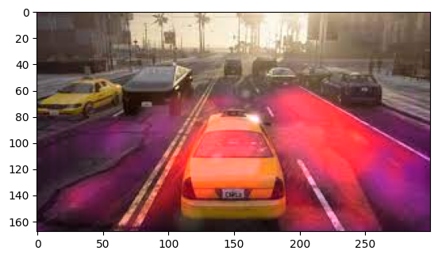

# Road Segmentation using Convolutional Neural Networks (CNN)


Welcome to my GitHub repository. Here's a link to the video showcasing my project:

[](https://youtu.be/uTCOs-Ybd1Y?feature=shared)

## Overview

This repository contains the implementation of a road segmentation model using Convolutional Neural Networks (CNNs). This project aims to accurately segment road pixels in images, enabling autonomous vehicles to understand road boundaries.

## Table of Contents

- [Demo Video](#demo-video)
- [Introduction](#introduction)
- [Dataset](#dataset)
- [Model Architecture](#model-architecture)
- [Usage](#usage)
- [Results](#results)
- [Contributions](#contributions)
- [License](#license)

## Demo Video

Check out the [demo video](outputs/Segmentation_final_video.mp4) showcasing the road segmentation model in action.

## Introduction

Road segmentation is a critical task in computer vision for autonomous driving. This project demonstrates the implementation of a CNN-based road segmentation model that takes input images and predicts pixel-wise road and non-road classes.

## Dataset

We used the UC Berkeley BDD 100K dataset for training and evaluation. It contains labeled images with pixel-level annotations for road regions. The dataset includes a variety of scenarios, lighting conditions, and road types.
 Fig. Test Image

## Model Architecture

Our road segmentation model is built using a FCN architecture, which has proven effective for image segmentation tasks. The architecture consists of an encoder that captures image features and a decoder that produces the segmentation mask. The model is trained end-to-end on the dataset.

## Usage

1. Clone this repository:

   ```bash
   git clone https://github.com/Lucifer2700/UCBerkley_Segmentation.git
   ```

2. Install the required dependencies:

   ```bash
   pip install -r requirements.txt
   ```

3. Train the model:

   ```bash
   python train.py
   ```

4. Evaluate the model:

   ```bash
   python evaluate.py
   ```

5. Run the road segmentation on your own images:

   ```python
   python predict.py --input input_image.jpg --output segmented_image.jpg
   ```

## Results

Our trained model achieves an accuracy of over 95% on the test dataset. The road segmentation output demonstrates accurate identification of road regions in various environments.

Here are some example results:

 Fig. Model Prediction
 Fig. Carla Prediction
## Contributions

Contributions to this project are welcome. If you find any issues or want to improve the model, feel free to submit a pull request or create an issue.

## License

This project is licensed under the MIT License - see the [LICENSE](LICENSE) file for details.
